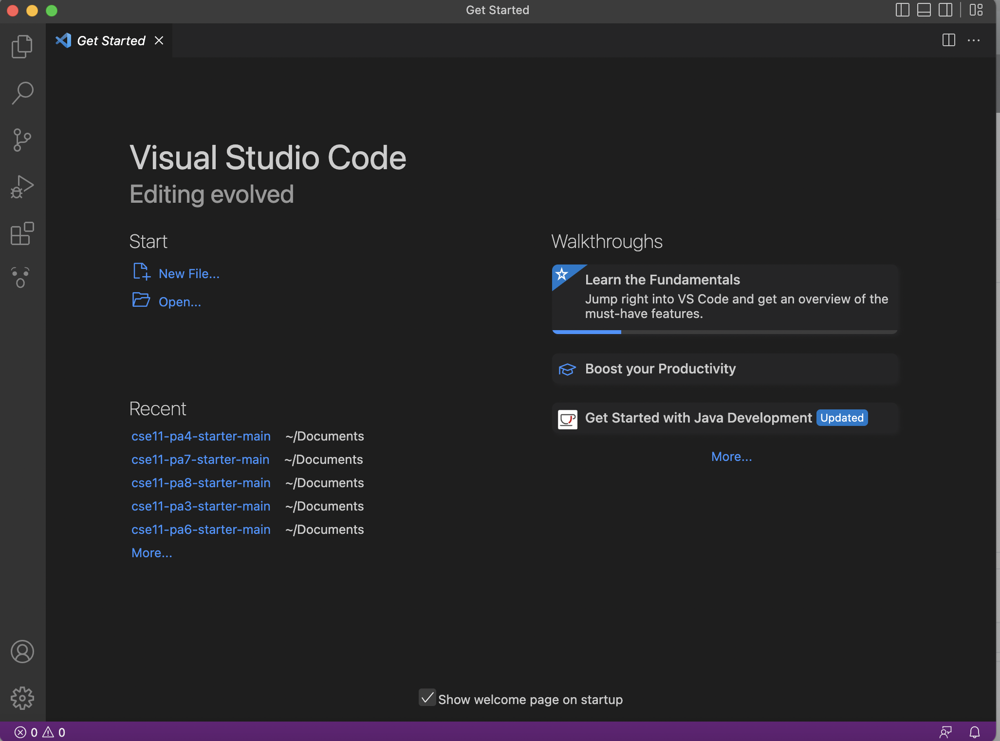
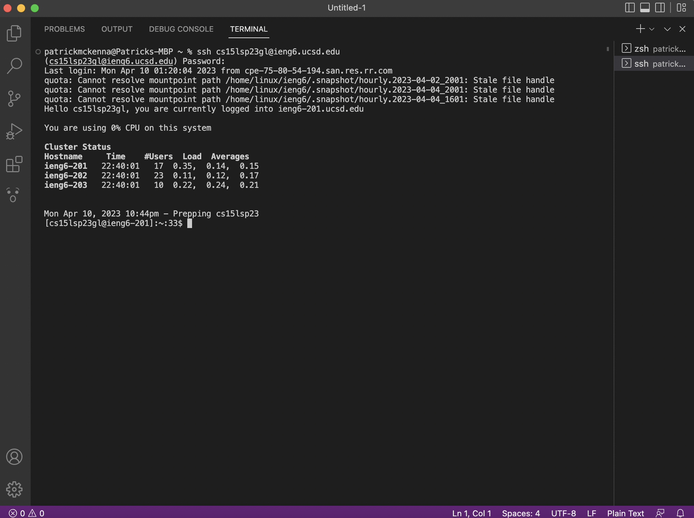
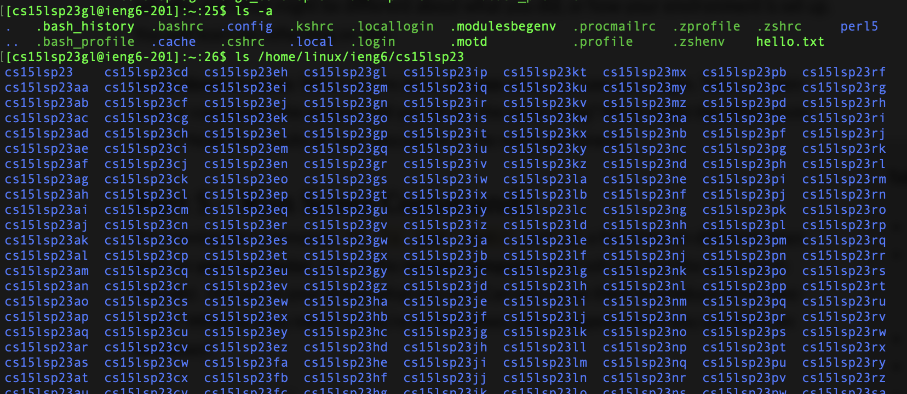

# Lab Report 1

## Installing VSCode: 
  To install VS code, head to [the VS Code website](https://code.visualstudio.com/), and follow the download instructions for your system. 
Once that is complete, open VS code, and you'll want to see something that looks like this 

Now you have VS Code instaled! 

## Remotely Connecting
  Now to remotely connect, since you're on mac, from VS code, you can open the terminal by pressing ``Control + ~``. 
 In the terminal, type ssh cs15lsp23*zz*@ieng6.ucsd.edu, with the *zz* replaced the letters specific to your own course account. 
 This will promt you for your password, and after correctly entering your password you should see something like this: 
 
 
 
 
## Trying some commands 
   You're now connected to a remote server. Try out the typical commands ``cd, ls, pwd, mkdir, cp``. Here is an example: 
   
 You should be able to play around with the files on the computer you're connected to. 
 To log out of the remote server, press Crtl-D.

## Other Lab 1 pages 
[Index](https://github.com/pmckenna2425/cse15l-lab-reports/index.html)

[DoNow](https://github.com/pmckenna2425/cse15l-lab-reports/donow.html)

