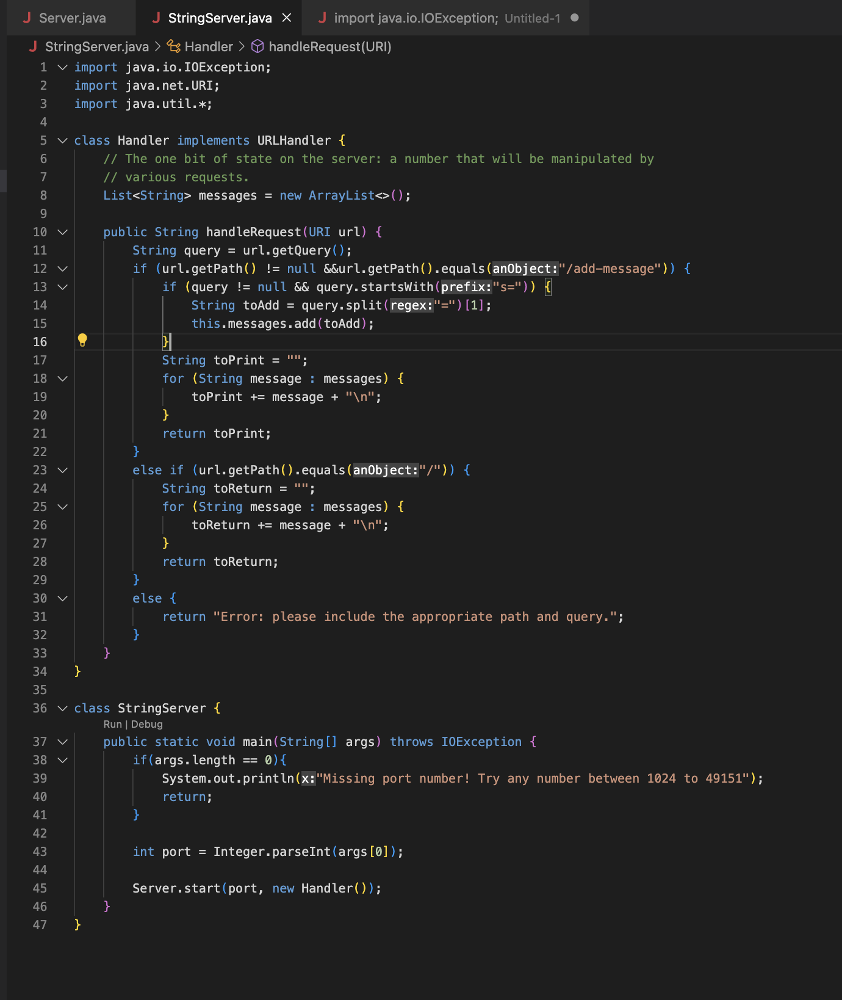

# Lab Report 1 - Servers and Bugs
## Part 1: 
For part 1 our goal was to write a web server called `StringServer` that concatenates a new line and a new string when the request 
`add-message?s=<String>` is prompted. 

I reused the `Server.java` file from [Lab2](https://github.com/pmckenna2425/wavelet), and I rewrote the methods from `NumberServer.java` in a new file called `StringServer.java` to accomplish these tasks.
What I did was initialize an empty `ArrayList` as a field in the `Handler` class to keep track of the messages, and for each method call to `Handler` my code adds the new message to the `ArrayList` called `messages`, and then returns each element of the `ArrayList` on a new line. 
The Code: 

The blank server looks just like this

And after performing `/add-method?s=Hello`, we get this: 

after the `/add-message?s=Hello` request is received, the `handleRequest` method in the `Handler` class is called. First, it checks to make sure that the appropriate path and query were performed, then it splits the query to obtain `Hello`, and adds it to `messages`. Next an empty `String` `toPrint` is initialized, and a for loop concatenates each element of the `messages` into a new line of `toPrint`. Finally, `toPrint` is returned. 
Notice that before this, `messages` was empty, and now `messages` has 1 element: `"Hello"`, which we see returned on the screen. 

another instance, using `/add-method?s=How are you`:

once again, request is received and the `handleRequest` method is called. This time the query is split to obtain `How are you`, and adds it to the next element in the `messages`. Once again, and empty `String` `toPrint` is intitialized and a for loop copies each element of the `ArrayList` into a new line in `toPrint`, and the returns the updated `toPrint`, which is different from previous iterations: it now contains a new line with the most recent message. 
Notice: before this, `messages` had 1 element, and now `messages` has two elements: `"Hello"` and `"How are you"`, which we see now returned on the screen as lines of `toPrint`. 

Finally, `/add-method?s=Go away spongebob`:

Now, messages has 3 elements, the newest being `"Go away spongebob"`. 

## Part 2: 
For this part, 
Choose one of the bugs from lab 3.

Provide:
1. A failure-inducing input for the buggy program, as a JUnit test and any associated code (write it as a code block in Markdown)
2. An input that doesn’t induce a failure, as a JUnit test and any associated code (write it as a code block in Markdown)
3. The symptom, as the output of running the tests (provide it as a screenshot of running JUnit with at least the two inputs above)
4. The bug, as the before-and-after code change required to fix it (as two code blocks in Markdown)
5. 
Briefly describe why the fix addresses the issue.

