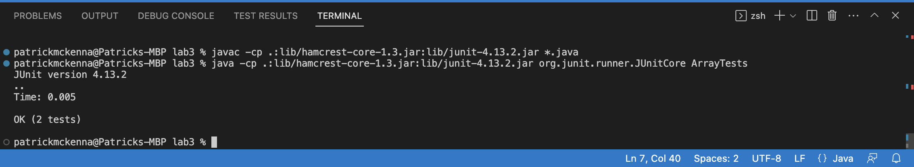

# Lab Report 2 - Servers and Bugs
## Part 1: 
For part 1 our goal was to write a web server called `StringServer` that concatenates a new line and a new string when the request 
`add-message?s=<String>` is prompted. 

I reused the `Server.java` file from [Lab2](https://github.com/pmckenna2425/wavelet), and I rewrote the methods from `NumberServer.java` in a new file called `StringServer.java` to accomplish these tasks.
What I did was initialize an empty `ArrayList` as a field in the `Handler` class to keep track of the messages, and for each method call to `Handler` my code adds the new message to the `ArrayList` called `messages`, and then returns each element of the `ArrayList` on a new line. 
The Code: 


The blank server looks just like this


And after performing `/add-method?s=Hello`, we get this: 

after the `/add-message?s=Hello` request is received, the `handleRequest` method in the `Handler` class is called. First, it checks to make sure that the appropriate path and query were performed, then it splits the query to obtain `Hello`, and adds it to `messages`. Next an empty `String` `toPrint` is initialized, and a for loop concatenates each element of the `messages` into a new line of `toPrint`. Finally, `toPrint` is returned. 
Notice that before this, `messages` was empty, and now `messages` has 1 element: `"Hello"`, which we see returned on the screen. 

another instance, using `/add-method?s=How are you`:

once again, request is received and the `handleRequest` method is called. This time the query is split to obtain `How are you`, and adds it to the next element in the `messages`. Once again, and empty `String` `toPrint` is intitialized and a for loop copies each element of the `ArrayList` into a new line in `toPrint`, and the returns the updated `toPrint`, which is different from previous iterations: it now contains a new line with the most recent message. 
Notice: before this, `messages` had 1 element, and now `messages` has two elements: `"Hello"` and `"How are you"`, which we see now returned on the screen as lines of `toPrint`. 

Finally, `/add-method?s=Go away spongebob`:

Now, messages has 3 elements, the newest being `"Go away spongebob"`. 


## Part 2: 
For this part, 
Choose one of the bugs from lab 3.

Provide:
* A failure-inducing input for the buggy program, as a JUnit test and any associated code (write it as a code block in Markdown)
* An input that doesn’t induce a failure, as a JUnit test and any associated code (write it as a code block in Markdown)
* The symptom, as the output of running the tests (provide it as a screenshot of running JUnit with at least the two inputs above)
* The bug, as the before-and-after code change required to fix it (as two code blocks in Markdown)
 
Briefly describe why the fix addresses the issue.

So for part 2, the bug I'll focus on is the `reverseInPlace` method in `ArrayExamples`:
```
  // Changes the input array to be in reversed order
  static void reverseInPlace(int[] arr) {
    for(int i = 0; i < arr.length; i += 1) {
      arr[i] = arr[arr.length - i - 1];
    }
  }
```
Now in the initial test in which `arr` has only 1 element `reverseInPlace` passes: 
```
public class ArrayTests {
	@Test 
	public void testReverseInPlace() {
    int[] input1 = { 3 };
    ArrayExamples.reverseInPlace(input1);
    assertArrayEquals(new int[]{ 3 }, input1);
	}
 	@Test 
	public void testReverseInPlace2() {
    int[] input1 = {1,2,3,4,5,6,7};
    ArrayExamples.reverseInPlace(input1);
    assertArrayEquals(new int[]{7,6,5,4,3,2,1}, input1);
	}
```
However, once we input `arr` with several elements, we see the symptom: 
 


The bug in the initial method is that as it goes through the `arr`, setting the first elements to the last elements, it doesn't also replace the last elements with the first elements. So by the time it is more than halfway through `arr`, the earlier elements in the first half have already already been changed. 

To fix this bug, I changed the `reverseInPlace` method to also update the elements towards the end of `arr`, so this time, instead of merely *changing* elements of `arr`, `reverseInPlace` is actually *swapping* them. Note: now `reverseInPlace` doesn't even need to iterate all the way through `arr`; it only needs to go halfway and `arr` is already reversed!
```
  static void reverseInPlace(int[] arr) {
    for(int i = 0; i < arr.length/2; i += 1) {
      int num = arr[i];
      arr[i] = arr[arr.length - 1 - i];
      arr[arr.length - 1 - i] = num; 
    }
  } 
```
This new code creates a new placeholder `int` called `num` to temporarily store the value of `arr[i]`, so that after changing `arr[i]` to be `arr[arr.length - 1 - i]`, the `reserveInPlace` method can also set `arr[arr.length - 1 - i]` to be what was originally `arr[i]`, thereby "switching" them. 

As we can see, `reverseInPlace` now passes all tests. 
 


# Part 3
So before weeks 2 and 3 I knew nothing about `urls`. Now I when I see a `url`, I see the `domain`, `path`, `query` and `anchor` which I can actually now type in instead of depending on copying `urls` all the time. In addition, I learned how to start a simple online `server` and write methods for what should happen when different `paths` and `querys` are requested: the `add-message?s=<String>` from **part 1**, for instance. 
