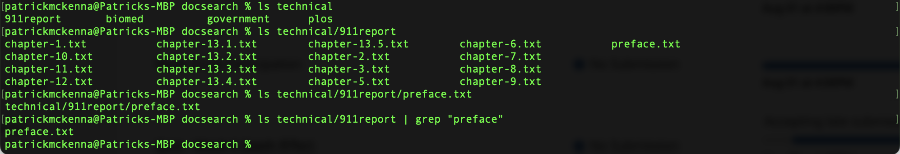
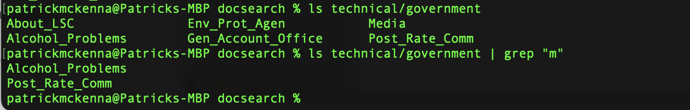
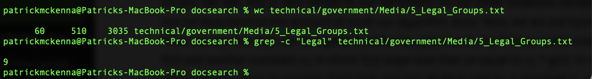

# Lab Report 3: Researching Commands
For this lab report I'll research `grep` alternatives and options. 

## `grep` as a filter for `ls`: 
By performing the usual `ls` command to list the contents of a path and then adding `| grep <String>`, we return only the files whose names contain `<String>`. Here's two examples from `./technical`: 
 
In this example, we can see that `technical/911report` has many files but only one containing `"preface"`. What the command
`ls technical/911report | grep "preface"` did is filter the `ls` command for only those files containing `"preface"`. 

In this example, we see that `technical/Government` has 6 files, but only two containing the letter `"m"`. Once again, adding 
`| grep "m"` to `ls technical/Government` filtered out every file that didn't contain the letter `"m"`. 

[source](https://docs.oracle.com/cd/E19504-01/802-5826/6i9iclf5k/index.html)

## `grep -c` to output count of matching lines only 

In this example 

[Grep](https://en.wikibooks.org/wiki/Grep)

