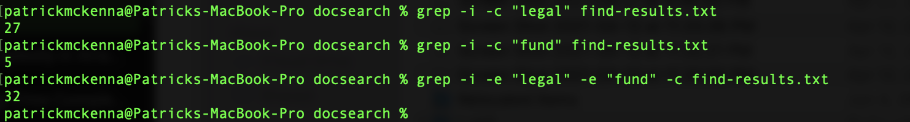

# Lab Report 3: Researching Commands
For this lab report I'll research `grep` alternatives and options. 

## `grep` as a filter for `ls`: 
By performing the usual `ls` command to list the contents of a path and then adding `| grep <String>`, we return only the files whose names contain `<String>`. Here's two examples from `./technical`: 
 
In this example, we can see that `technical/911report` has many files but only one containing `"preface"`. What the command
`ls technical/911report | grep "preface"` did is filter the `ls` command for only those files containing `"preface"`. 

In this example, we see that `technical/Government` has 6 files, but only two containing the letter `"m"`. Once again, adding 
`| grep "m"` to `ls technical/Government` filtered out every file that didn't contain the letter `"m"`. 

[Grep](https://docs.oracle.com/cd/E19504-01/802-5826/6i9iclf5k/index.html)

## `grep -c` to output count of matching lines only 
By adding `-c` to our usual `grep` command, `grep -c <String>`, we output the count of the lines containing the String. 

In this example, we see that path `technical/government/Media/5_Legal_Groups.txt` has 60 lines and 510 words. By performing 
`grep -c "Legal" technical/government/Media/5_Legal_Groups.txt`, we get the exact number of lines in the `5_Legal_Groups.txt` containing the 
word `"Legal"`. 

Here is another example playing with a file I created, `grep-Legal.txt`, in which I also used `grep`, to store all the files of `find-results.txt` containing the word `"Legal"`. 
 
Firstly, we see that the file contains 21 lines. Then I play around `grep -c <String> grep-Legal.txt` to see how many lines, if any, contain a String. As we can see, no lines contain `"count"`, one line contains `"service"` (lower case, that is), and one line contains `"and"` (Note: this only occurs as a substring of "Maryland" not actually the word "and"). I then printed the contents of the file to confirm. 

[Grep](https://en.wikibooks.org/wiki/Grep)

## `grep -i` to ignore case. 
In the previous example of `-c`, we saw that only one line contains `"service"` in `grep-Legal.txt`. However, if one was looking directly at the lines that I printed out at the end, it may look like 3 lines contain `"service"`. This is because the `grep` command is case-sensitive and only 1 line contained a lower-case `"service"` String. However, there is a way to get around this! If I were to add `-i` to my `grep` command from before, then it would ignore case differences. 

As we can see, the command `grep -i -c "service" grep-Legal.txt` returns 3, including all lines containing the String `"service"` in a non-case-sensitive manner. 

Let's try with some other words in `find-results.txt`.

As we can see, `grep -c "research" find-results.txt` and the same command include `-i` both returned the same number, so `"research"` always occurs in lines of `find-results.txt`. However, only 5 lines in `find-results.txt` contained `"aid"` in lowercase, but 16 lines contained the word `"aid"`. We see this becuase `grep -c "aid" find-results.txt` returns 5 while `grep -i -c "aid" find-results.txt` returns 16. 
So we conclude that `"aid"` occurs only 5 times in lowercase in `find-results.txt` but 16 times in total non-case-sensitive. 

[Grep](https://en.wikibooks.org/wiki/Grep)

## `-e` to use more patterns with `grep`
We just saw how to ignore cases in the case of `"aid"` in `find-results.txt`. However, theres another, albeit less efficient way to get the same result: adding `-e <String>` to add different patterns, in this case, case patterns. This allows us to search for all lines containing `"aid"` in several different cases: 

On the first try I did `grep -e "aid" -e "Aid" -c find-results.txt` and got 15, meaning I all but 1 case of `"aid"` in `find-results.txt` are either `"aid"` or `"Aid"` with a capital A. As we see in the second try, the last case of `"aid" is in all caps. With `-e` I was able to search for multiple patterns at once, instead of performing multiple `grep` commands. Note also that I'm combining this with `-c` for the sake of a simple quantitative answer. 

Let's try another example with a different String, in `find-results.txt`. 
 
Here I first counted the total number of lines containing the non-case-sensitive word `"legal"` in `find-results.txt`. Then I did the same with the word `"fund"`. Next I performed the command `grep -i -e "legal" -e "fund" -c find-results.txt`, essentially combining the two previous commands into 1. I got the sum of the two first commands, so I successfully got all the lines containing either `"legal"` or `"fund"` in `find-results.txt`. Note that I included `-i` to ignore cases, and `-c` to once again return only the count for the sake of simplicity. 
*Note* in the case that a line contains both of the patterns, that line would only be included once. In the previous exmaple we see that no line contained both `"legal"` and `"fund"` because the third `grep` command returned the some of the first two `grep` commands. If it was less than the sum, we could deduce that both patterns appeared together on some lines. 

For this `-e` option, I actually asked chatgpt for some ideas, and I got -e, which I liked. 
