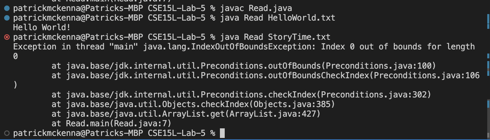
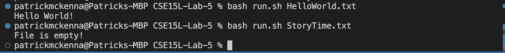

# Lab Report 5 

## Part 1 - Debugging Scenario
From Week 9: 
```
Design a debugging scenario in the spirit and style of the ones above. Write your report as a conversation on EdStem. It should have:

1. The original post from a student with a screenshot showing a symptom and a description of a guess at the bug/some sense of what the 
failure-inducing input is. (Don’t actually make the post; just write the content that would go in such a post.) A template of the format 
of the post can be found by clicking “New Thread” -> Question -> Debugging on EdStem.

1. A response from a TA asking a leading question or suggesting a command to try (To be clear, you are mimicking a TA here.)
2. Another screenshot/terminal output showing what information the student got from trying that, and a clear description of what the bug is.
3. At the end, all the information needed about the setup including:
  * The file & directory structure needed
  * The contents of each file before fixing the bug
  * The full command line (or lines) you ran to trigger the bug
  * A description of what to edit to fix the bug

You should actually set up and run the scenario from your screenshots. It should involve at least a Java file and a bash script. 
Describing the bug should involve reading some output at the terminal resulting from running one or more commands. Design an error that 
produces more interesting output than a single message about a syntax or unbound identifier error – showcase some interesting wrong 
behavior! Feel free to set this up by cloning and breaking some existing code like the grading script or code from class, or by designing 
something of your own from scratch, etc.
```

So for my scenario, the student is writing a sipmle java method to read the first line from some file given as the first argument, but 
is getting an error when the text file is empty. He has written his main method: 
```
import java.nio.file.*;
import java.util.*;

public class Read {
    public static void main(String[] args) throws Exception {
        List<String> lines = Files.readAllLines(Paths.get(args[0]));
        String line = lines.get(0);
        System.out.println(line);
    }
}
```

**Student:**
 I'm working on VSCode on my mac book pro. 
 I'm trying to write a program that reads the first line of a file and prints it out. When the file has a first line my method is runnning
 as expected but when I try to use an empty file I'm getting an IndexOutOfBounds Exception: 
 


**TA:** 
 Hmm can you try running with java? This will help me determine if the error is in your bash script or method itself. 
 
 **Student:** 
  Yeah my bash script is pretty simple though – it just compiles and runs my file – so I doubt it's causing any error. 


**TA:**
 So from the `Index 0 out of bounds for length 0`, it seems that your method isn't sufficiently taking into account whether the file 
 is empty–in which case the array would have no elements (i.e. 0 is not a valid index). 
 
**Student:**
 Ah I got it, thanks. I was putting the contents of the file into a list and then printing out the element at index 0 without even 
 checking that the list had an index 0. (I mistakenly associated an empty list with one still having an index 0). 


**TA:** 
 No problem! please do hesitate in the future to waste our time with your incompetence. 
 
 
 **File Structure:** 
 ```
 /CSE15L-LAB-5
  /HelloWorld.txt
  /Read.java
  /run.sh
  /StoryTime.txt
 ```
 
**Files before** 
`Read.java`:
```
 import java.nio.file.*;
import java.util.*;

public class Read {
    public static void main(String[] args) throws Exception {
        List<String> lines = Files.readAllLines(Paths.get(args[0]));
        String line = lines.get(0);
        System.out.println(line);
    }
}
```
`run.sh`: 
```
javac Read.java
java Read $1
```
`HelloWorld.txt`:
```
Hello World!
```
`StoryTime.txt` is empty. 
 
**Files After:** 
`Read.java`: 
```
import java.nio.file.*;
import java.util.*;

public class Read {
    public static void main(String[] args) throws Exception {
        List<String> lines = Files.readAllLines(Paths.get(args[0]));
        if (lines.size() != 0) {
            String line = lines.get(0);
            System.out.println(line);
        }
        else {
            System.out.println("File is empty!");
        }
    }
}
```

`run.sh` same
`HelloWorld.txt` same
`StoryTime.txt` same 

**Command line:**
`bash run.sh HelloWorld.txt` worked as expected 
`bash run.sh StoryTime.txt` triggered the bug, but works as expected after fix. 

**Fix:**
The student just needed to make sure that list created to contain the lines of the file was non empty. This was accomplished by adding 
the `if` statement 
```
 if (lines.size() != 0) {
            String line = lines.get(0);
            System.out.println(line);
}
```


## Part 2 – Reflection 
In a couple of sentences, describe something you learned from your lab experience in the second half of this quarter that you didn’t 
know before. It could be a technical topic we addressed specifically, something cool you found out on your own building on labs, something
you learned from a tutor or classmate, and so on. It doesn’t have to be specifically related to a lab writeup, we just want to hear about 
cool things you learned!

So the biggest thing that I learned from my lab experience is how to use the command line to accomplish so much more than just compile. For instance, to use vim to make quick edits to my code directly, and to use git to edit and push things to my github repositories. 
In addition, knowing simple bash scripts is really helpful and something I didn't know how to do before. For instance, using JUnit can be exhausting due to constantly needing to find and copy the right compiler and runner commands. But I could do that all at once and not need anything else by just putting those commands into a simple bash script and running that each time. 

